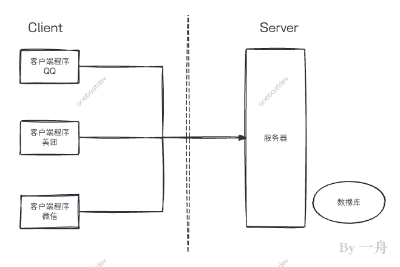
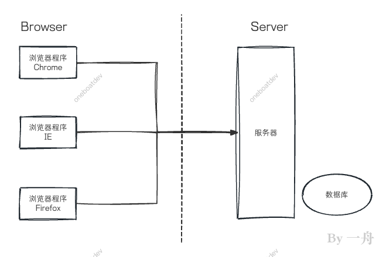
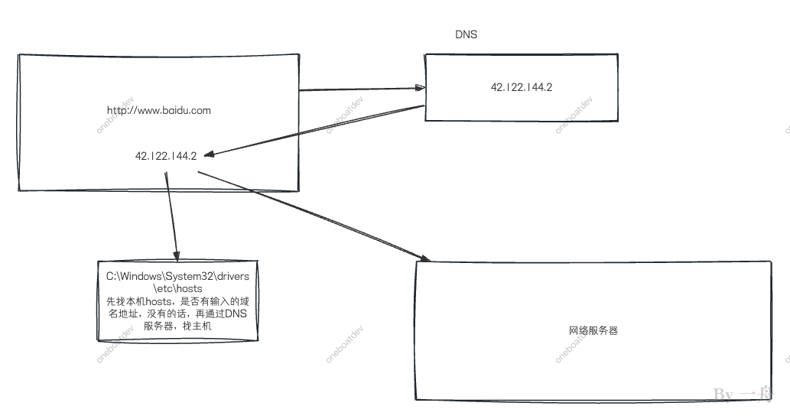

# 网络编程概述
在当今万物互联的时代，网络编程是软件开发中不可或缺的核心技能。它让分散在世界各地的计算机能够协同工作，共享数据与服务。Java 语言从诞生之初就为网络编程提供了强大的原生支持，通过 `java.net` 包，可以轻松地构建出健壮的网络应用程序，而无需深陷底层协议的复杂性之中。

## 软件架构与网络基础
当前主流的软件架构分为两种模式：

+ **C/S架构（Client/Server）**：即客户端/服务端架构。这种模式要求用户在本地设备上安装专门的客户端软件，例如QQ、微信或各类手机App。客户端负责与用户交互，并与远程服务器通信。其优势在于可以提供更丰富的功能和更佳的用户体验。

  

+ **B/S架构（Browser/Server）**：即浏览器/服务器架构。用户只需要通过浏览器即可访问服务，例如日常使用的各种网站。其优势在于无需安装和维护客户端，升级和部署非常方便。
  

无论采用哪种架构，其本质都是**网络编程**，即在特定协议的约束下，实现两台或多台计算机之间的数据通信。网络编程的本质，就是在特定协议规范下，实现计算机之间的数据交换。

## 网络编程需要解决的三大核心问题
1. **定位问题**：如何准确地找到网络上的一台或多台主机？
2. **应用识别问题**：如何定位主机上特定的应用程序？
3. **数据传输问题**：找到目标后，如何可靠、高效地传输数据？

这三个问题分别对应着IP地址/域名、端口号、网络通信协议这三个核心概念。

# 网络通信三要素
## IP地址与域名：网络世界的“门牌号”
**IP地址(Internet Protocol Address)**是互联网协议地址，用于给网络中的每台设备分配唯一的编号。它就像现实生活中的门牌号，没有它就无法准确定位目标设备。

IP地址主要分为两个版本：

+ **IPv4**：目前应用最广泛的版本，由32位二进制数组成，通常以点分十进制表示，如`92.168.65.100`，理论上可表示约42亿个地址。由于互联网的迅猛发展，IPv4地址已于2011年耗尽。
+ **IPv6**：为了解决地址枯竭问题而设计的下一代协议，采用128位地址长度，使用冒号十六进制表示，如`ABCD:EF01:2345:6789:ABCD:EF01:2345:6789`，提供了近乎无限的地址空间。IPv6不仅解决了地址短缺问题，还增强了安全性、移动性和服务质量等方面的能力。2018年起，三大运营商联合阿里云开始全面推广IPv6服务。

IP地址还可按用途分为**公网地址**（全球唯一，用于互联网通信）和**私有地址**（局域网内部使用，如`92.168.x.x`）。私有地址的出现缓解了IPv4地址压力，也增强了内网安全性。

**域名**的出现是因为IP地址难以记忆。域名系统（DNS）负责将人类易记的域名（如`www.oneboatdev.com`）转换为计算机可识别的IP地址。这个解析过程涉及本地hosts文件、本地DNS缓存、根DNS服务器等多级查询机制。

**域名解析过程：**


**代码示例：使用**`**InetAddress**`**类**

Java中的`InetAddress`类封装了对IP地址的操作

```java
import java.net.InetAddress;
import java.net.UnknownHostException;

public class InetAddressDemo {
    public static void main(String[] args) throws UnknownHostException {
        // 获取本机地址信息
        InetAddress localHost = InetAddress.getLocalHost();
        System.out.println("本机名称: " + localHost.getHostName());
        System.out.println("本机IP: " + localHost.getHostAddress());

        // 通过域名获取IP地址
        InetAddress webAddress = InetAddress.getByName("www.oneboatdev.com");
        System.out.println("域名对应的IP: " + webAddress.getHostAddress());
    }
}
```

## 端口号：应用程序访问的“房间号”
一台计算机上可能同时运行着多个网络程序（如浏览器、聊天软件、游戏等）。IP地址只能定位到这台计算机，而端口号则用于唯一标识计算机中的具体进程（应用程序）。

端口号是一个16位的整数，取值范围0~65535，主要分为三类：

+ **公认端口（0~1023）**：预留给系统服务使用，如HTTP（80）、FTP（21）、Telnet（23）
+ **注册端口（1024~49151）**：分配给用户进程或应用程序，如Tomcat（8080）、MySQL（3306）
+ **动态/私有端口（49152~65535）**：临时分配给客户端程序使用

**IP地址与端口号的组合构成了套接字（Socket），它是网络通信的唯一标识。**

## 网络通信协议：通信的“规则”
网络通信涉及内容繁多：数据格式、传输速率、差错控制、流量控制等。为了解决复杂性，网络协议采用了**分层思想**——将复杂功能分解为若干层次，每层专注解决特定问题，层与层之间通过接口交互。

目前主流的参考模型是**TCP/IP四层模型**：

| 层次 | 功能 | 主要协议 |
| --- | --- | --- |
| 应用层 | 为用户提供应用服务 | HTTP、FTP、SMTP、DNS |
| 传输层 | 端到端的数据传输控制 | TCP、UDP |
| 网络层 | 数据分组与路由选择 | IP |
| 网络接口层 | 物理传输通道 | 以太网、Wi-Fi驱动 |


这种分层设计使得各层可以独立演进，降低了协议的复杂性。

---

# TCP协议与UDP协议详解
Java的`java.net`包封装了底层网络通信细节，提供了对TCP和UDP两种传输层协议的支持。

## TCP协议：可靠的数据传输
TCP（传输控制协议）是一种**面向连接、可靠、基于字节流**的传输协议。它的核心特性包括：

+ **建立连接**：通信前必须通过"三次握手"建立连接
+ **可靠传输**：通过确认机制、重传机制保证数据完整到达
+ **有序传输**：数据包按序号重组，保证接收顺序与发送顺序一致
+ **流量控制**：根据接收方处理能力动态调整发送速率
+ **面向字节流**：将数据视为连续的字节流，无边界限制

TCP适用于对数据完整性要求高的场景，如文件下载、网页浏览、邮件传输等。

## UDP协议：高效的即时传输
UDP（用户数据报协议）是一种**无连接、不可靠、面向数据报**的传输协议。它的核心特性包括：

+ **无需建立连接**：发送前不进行握手，直接发送数据
+ **不可靠传输**：不保证数据到达，不提供确认和重传
+ **数据报边界**：每次发送一个完整的数据报，接收方需一次性读取
+ **效率高**：协议开销小，通信速度快
+ **大小限制**：每个数据报最大64KB

UDP适用于实时性要求高、可容忍少量丢包的场景，如视频会议、在线游戏、直播等。

## 三次握手：TCP连接的建立
TCP通过"三次握手"建立可靠连接，其过程如下：

**第一次握手**：客户端向服务器发送SYN报文（序列号seq=x），表示请求建立连接，客户端进入SYN_SENT状态。

**第二次握手**：服务器收到后，返回SYN+ACK报文（seq=y, ack=x+1），表示确认收到请求并同意建立连接，服务器进入SYN_RCVD状态。

**第三次握手**：客户端收到确认后，发送ACK报文（seq=x+1, ack=y+1），确认服务器的确认。双方进入ESTABLISHED状态，连接建立成功。

三次握手保证了双方都具有收发能力，同时协商了初始序列号，为可靠传输奠定基础。

## 四次挥手：TCP连接的释放
连接断开需要"四次挥手"：

1. 客户端发送FIN报文，表示不再发送数据，进入FIN_WAIT_1状态
2. 服务器回复ACK报文，确认收到关闭请求，进入CLOSE_WAIT状态
3. 服务器发送完剩余数据后，发送FIN报文，进入LAST_ACK状态
4. 客户端回复ACK报文，进入TIME_WAIT状态，等待2MSL后彻底关闭

这个设计确保了双方都能完成数据传输，避免数据丢失。

---

# Socket编程基础
Socket是网络通信的端点，封装了IP地址和端口号。Java提供了两类Socket：

## TCP Socket
+ **ServerSocket**：服务器端套接字，用于监听客户端的连接请求
+ **Socket**：客户端套接字，用于与服务器建立连接并通信

核心方法：

```java
// 服务端
ServerSocket server = new ServerSocket(port);
Socket socket = server.accept();  // 阻塞等待客户端连接

// 客户端
Socket socket = new Socket(host, port);
InputStream in = socket.getInputStream();
OutputStream out = socket.getOutputStream();
```

## UDP Socket
+ **DatagramSocket**：数据报套接字，用于发送和接收UDP数据包
+ **DatagramPacket**：数据报包，封装了数据、地址和端口

核心方法：

```java
// 发送端
DatagramSocket ds = new DatagramSocket();
DatagramPacket dp = new DatagramPacket(data, length, address, port);
ds.send(dp);

// 接收端
DatagramSocket ds = new DatagramSocket(port);
DatagramPacket dp = new DatagramPacket(buffer, buffer.length);
ds.receive(dp);  // 阻塞等待数据报
```

---

# URL编程
**URL（统一资源定位符）** 是Internet上资源地址的标准表示方式，其基本结构为：

```latex
协议://主机名:端口号/文件路径#片段名?参数列表
```

例如：

```latex
http://192.168.1.100:8080/helloworld/index.jsp#a?username=shkstart&password=123
```

Java的`URL`类提供了访问网络资源的便捷方式：

```java
import java.net.URL;

public class URLDemo {
    public static void main(String[] args) throws Exception {
        URL url = new URL("http://localhost:8080/examples/myTest.txt?name=java");
        System.out.println("协议: " + url.getProtocol());   // 输出: http
        System.out.println("主机: " + url.getHost());       // 输出: localhost
        System.out.println("端口: " + url.getPort());       // 输出: 8080
        System.out.println("路径: " + url.getPath());       // 输出: /examples/myTest.txt
        System.out.println("查询: " + url.getQuery());      // 输出: name=java
    }
}
```

`URLConnection`类提供了更丰富的功能，如获取内容类型、内容长度、最后修改时间等元数据，以及向服务器发送数据的能力。

  

